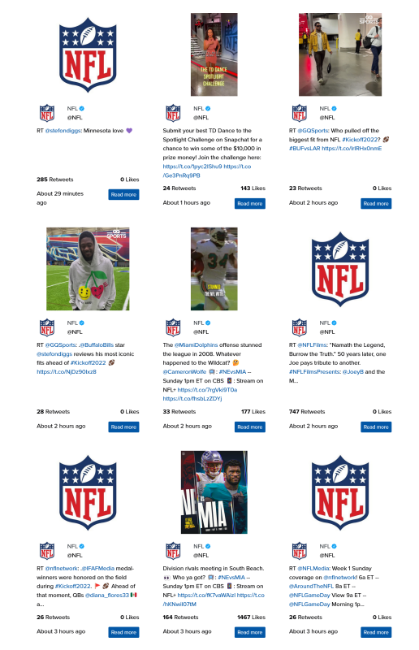

# BtbTweet - Free Twitter Module

A DNN (DotNetNuke) module to display tweets from Twitter on your site. Simple and lightweight. Customise the layout using the built in templates or create your own.

V4.0.0 now contains support for media images used in the Tweet results.

## Simple Setup

Two modes use to select the tweets to display in the module.
* Display a user's timeline
* Display tweets based on a search

Results are cached for 15 minutes to improve performance.

## Template Based
The results are rendered using a template, the modules has three templates already.

* Angular Template, AJAX template
* React Template, AJAX template
* Razor Template

The templates use Bootstrap 4 but you are free to modifiy the templates to use whatever CSS framework that the skin uses.

### Creating a New Template

The templates are located in the folder `DesktopModules/BtbTweet/Templates`
To create a new template create a razor file in the folder then in the module settings pick the new file to use to output the data.
## Free Open Source License

GNU v3 license - Use for free on any DNN site.
